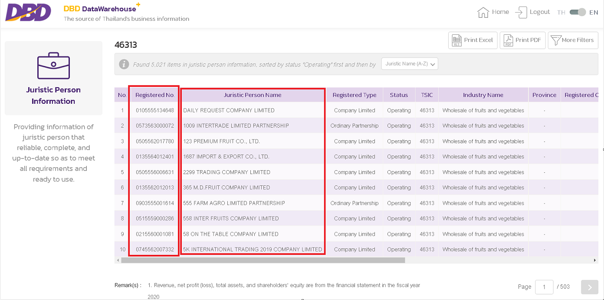
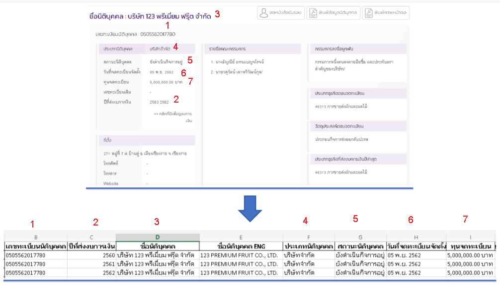

# Python-web-scraper-csv-export

Thailand Development Research Institute (TDRI)| April 2021 - July 2021

Extract data from [The source of Thailand's business information](https://datawarehouse.dbd.go.th/index) and export as CSV files.

    Extract companies' registeration numbers and their name. Save the result as txt files.

Link to the code: [Company numbers and names txt](https://github.com/saeth40/Python-web-scraper-csv-export/blob/main/Get_company__codes_and_names.ipynb)

    Save all companies data as Html files

Link to the code: [Get Html files](https://github.com/saeth40/Python-web-scraper-csv-export/blob/main/Get_Html.ipynb)

    Transform Html files of all companies into CSV files.

Link to the code: [Html to CSV](https://github.com/saeth40/Python-web-scraper-csv-export/blob/main/Html_to_CSV.ipynb)
